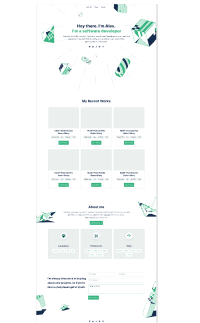

Live link to the project: https://rega1237.github.io/

# Deploy my portafolio to github page

> In this project, i deploy my portafolio. My goal here was to configure my repo and upload with gitup page

 

## Built With

- HTML & CSS
- Javascript

## Getting Started

To get a local copy up and running follow these simple steps:

1. Go to the [repository page](https://github.com/rega1237/Portfolio-setup-and-mobile-version-skeleton).
2. Press the "Code" button and copy the link.
3. Clone it using git command `git clone <link>`.

## :blue_book: Learning Objectives

- Understand how to parse a Figma design to create a UI.
- Flexbox and Grid to place elements in the page.
- Build a form for the personal portafolio
- Use images and backgrounds to enhance the look of the website.
- Make it look as close as possible to the design presented in figma
- Use Javascript to make interactive

## Authors

👤 **Author**

- GitHub: [@githubhandle](https://github.com/rega1237)

## 🤝 Contributing

Contributions, issues, and feature requests are welcome!

Feel free to check the [issues page](../../issues/).

## Show your support

Give a ⭐️ if you like this project!

## Acknowledgments

- Hat tip to anyone whose code was used
- Inspiration
- etc

## 📝 License

This project is [MIT](./MIT.md) licensed.